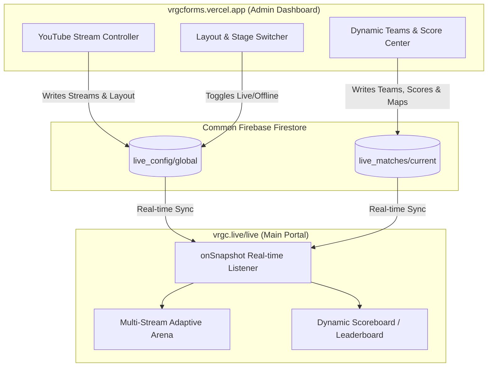
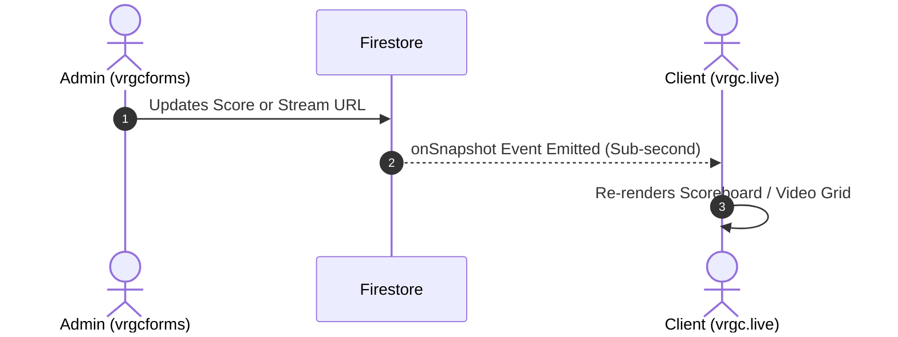

# Real-Time Live Hub & Remote Admin Architecture Blueprint

**Projects Involved:**
- **Control Panel / Remote Admin:** `vrgcforms.vercel.app`
- **Main Client Portal:** `vrgc.live` (`/live` route)
- **Shared Data Layer:** Common Firebase (Firestore Database)

---

## 1. System Architecture Overview



---

## 2. Shared Firestore Database Schema

To prevent collisions with existing tables (such as forms or member registrations), all live system data is contained under a dedicated `live_*` namespace.

### Collection: `live_config` / Document: `global`

Controls stream status, multi-stream feeds, and layout rules.

| Field | Type | Description | Example |
| :--- | :--- | :--- | :--- |
| `isLive` | `boolean` | Master broadcast switch | `true` |
| `broadcastState` | `string` | Current stream state | `'live'` \| `'starting_soon'` \| `'offline'` |
| `layoutMode` | `string` | Stream viewing arrangement | `'auto'` \| `'single'` \| `'split-2'` \| `'quad-4'` |
| `activeStreamIndex` | `number` | Default unmuted / primary stream | `0` |
| `updatedAt` | `timestamp` | Server timestamp of last edit | `ServerTimestamp` |
| `streams` | `array<object>` | List of dynamic live stream feeds | See stream schema below |

#### Stream Object Schema (`streams` array):
```json
[
  {
    "id": "stream-1",
    "title": "Main Stage - Hindi Cast",
    "youtubeId": "dQw4w9WgXcQ",
    "isActive": true,
    "order": 1
  },
  {
    "id": "stream-2",
    "title": "Stream B - Tactical POV & Map",
    "youtubeId": "5qap5aO4i9A",
    "isActive": true,
    "order": 2
  }
]
```

---

### Collection: `live_matches` / Document: `current`

Manages live match data, round/map progression, and dynamic team scores.

| Field | Type | Description | Example |
| :--- | :--- | :--- | :--- |
| `gameType` | `string` | Format type for layout engine | `'bracket'` (FPS) \| `'battle_royale'` (Multi-squad) |
| `tournamentName`| `string` | Display tournament header | `"VRGC Campus Cup 2026"` |
| `stage` | `string` | Match tier or stage | `"Grand Finals - Map 3 (Ascent)"` |
| `status` | `string` | Match status indicator | `'upcoming'` \| `'live'` \| `'halftime'` \| `'ended'` |
| `showScoreboard`| `boolean` | Admin toggle to hide/reveal scores | `true` |
| `teams` | `array<object>` | Dynamic array of teams | See team schema below |

#### Team Object Schema (`teams` array):
```json
[
  {
    "id": "team-01",
    "name": "Team Soul",
    "tag": "SOUL",
    "logo": "https://vrgc.live/teams/soul.png",
    "score": 11,
    "kills": 14,
    "placement": 1,
    "isEliminated": false,
    "accentColor": "#7c3aed"
  },
  {
    "id": "team-02",
    "name": "GodLike Esports",
    "tag": "GODL",
    "logo": "https://vrgc.live/teams/godl.png",
    "score": 9,
    "kills": 8,
    "placement": 2,
    "isEliminated": false,
    "accentColor": "#f59e0b"
  }
]
```

---

## 3. Remote Admin Dashboard (`vrgcforms.vercel.app`)

### Module 1: Broadcast & Video Feeds Manager
1. **URL Parser:** Auto-extracts standard 11-character YouTube video IDs from inputs (supports `youtube.com/watch?v=...`, `youtu.be/...`, or live URLs).
2. **Stream Array Controls:**
   - Add new stream feed with custom label and ID.
   - Toggle stream visibility (`isActive: true/false`).
   - Drag/drop or button-based order sorting.
   - Master "Go Live" / "Offline" button.
3. **Layout Mode Selector:**
   - **Auto Mode:** Automatically adjusts based on count of active streams.
   - **Single View:** Centers 1 main stream feed.
   - **Dual Split:** 50/50 split for multi-perspective streams.
   - **Quad Grid:** 2x2 multi-perspective tournament arena.

### Module 2: Real-Time Scoring & Dynamic Team Engine
1. **Mode Switcher:**
   - **2-Team Head-to-Head (Valorant / CS2 / FIFA):**
     - Big score buttons (`+1`, `-1`).
     - Swap Attack/Defense sides in 1-click.
     - Overtime / Match Point badges.
   - **Multi-Squad Leaderboard (BGMI / Free Fire / Fall Guys):**
     - Add arbitrary number of squads ($2$ to $25+$ squads).
     - Per-squad score / kills counters and elimination toggles.
     - One-click auto-sort by cumulative points.
2. **Quick Match Actions:**
   - Reset current map scores.
   - Advance to next map / round.

---

## 4. Main Portal Integration (`vrgc.live/live`)

### Component 1: Real-Time Firebase Listener


- Connects via `onSnapshot(doc(db, "live_config", "global"), ...)` and `onSnapshot(doc(db, "live_matches", "current"), ...)`.
- Zero page refreshes required; changes update smoothly in real time.

### Component 2: Responsive Multi-Stream Arena
- **1 Stream Active:** Cinematic 16:9 Theatre mode.
- **2 Streams Active:** Dual split side-by-side view with an audio toggle selector ("Audio: Feed 1 / Feed 2") to avoid overlapping sound.
- **3-4 Streams Active:** 2x2 interactive grid with click-to-expand capability.
- **Mobile View (<768px):** Automatically switches to a tabbed video switcher (`[Main Cast]`, `[Map POV]`, `[Player Camera]`) to ensure smooth performance without phone lag.

### Component 3: Adaptive Scoreboard UI
- **If `teams.length === 2`:**
  - Renders a horizontal esports broadcast HUD (large team names, map counter, live score counter).
- **If `teams.length > 2`:**
  - Automatically transitions to a compact leaderboard table with ranking, team logos, kills, alive/eliminated badges, and live position change animations.

---

## 5. Implementation Roadmap & Prompting Guide

### Phase 1: In `vrgcforms.vercel.app`
> **Prompt Instruction:**
> "Build an administrative Live Broadcast Control Center under `/admin/live`. Connect to the shared Firebase Firestore instance and implement real-time writes for `live_config/global` (dynamic YouTube video feeds and layout states) and `live_matches/current` (game format, score increments, and dynamic team management)."

### Phase 2: In `vrgc.live`
> **Prompt Instruction:**
> "In `src/pages/live.tsx`, replace static stream embeddings and hardcoded match scores with real-time `onSnapshot` listeners to `live_config/global` and `live_matches/current`. Implement an adaptive multi-stream grid supporting 1 to 4 streams with audio focus switching, and build an adaptive scoreboard that dynamically switches between head-to-head HUD (2 teams) and a scrollable tournament leaderboard (N teams)."

---

## 6. Critical Technical Best Practices

1. **Prevent Video Reloads during Score Updates:**
   - Keep the YouTube player component in a separate React component wrapped in `React.memo()`. The score updates should never re-render or reload the iframe.
2. **Audio Management:**
   - Set `mute=1` on all secondary stream iframes by default. Unmute only the selected stream so audio streams never clash.
3. **Optimistic Admin Updates:**
   - In `vrgcforms`, update the UI state immediately on button press while the Firestore async write completes in the background.
